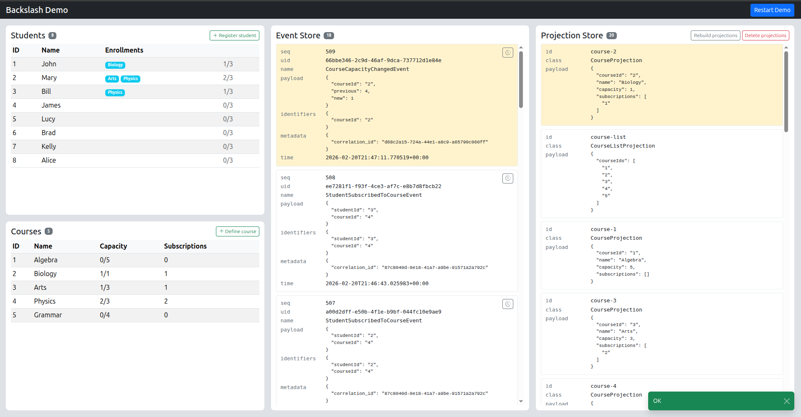

## Event sourcing is often overlooked

A lot of people hesitate to adopt event sourcing. The literature is full of distributed systems, eventual consistency,
sophisticated event stores, and architectural diagrams that look like they belong at Netflix. It's easy to walk away
thinking this is not for me.

Most of that complexity is self-inflicted. None of it is inherent to event sourcing. It's a set of choices, and you can
make different ones.

## The best way to learn is to build

Reading about event sourcing only goes so far. At some point you have to transform theory into practice. And the best
way to truly understand how it works is to build your own framework.

The word "framework" can feel intimidating, but it doesn't need to be. You can start very small. A SQLite database to
store events. Serialized classes for projections. The closer you stay to technologies you already know, the easier it is
to understand what's actually happening. You can always make it more sophisticated later, if you ever need to.

In 2016 I wanted to learn event sourcing and CQRS. [Broadway](https://github.com/broadway/broadway), a PHP framework
inspired by [Axon](https://www.axoniq.io/), gave me a starting point. But I needed to build my own to truly understand.
I used a low-risk internal project as a sandbox: a new timesheet and leave request management tool. A real project, real
constraints, but nothing critical if things went sideways: at the time, timesheets were still done on paper.

## What Backslash is

That project became the foundation of [Backslash](https://backslashphp.github.io/). And building it from scratch
confirmed something important: the fears around event sourcing are largely unfounded once you make deliberate choices
about what to include and what to leave out.

Eventual consistency is not a requirement. The event store is a single MariaDB table. Projections are PHP classes
serialized into MongoDB. No message broker, no distributed infrastructure. That setup has been running in production for
10 years without problems.

Most applications don't need to be available 24/7, don't need to handle thousands of concurrent users, and can tolerate
a few minutes of downtime during a deployment. That's the reality of a lot of software out there, even if the industry
rarely talks about it. Backslash is designed for that world.

Backslash is designed for human-scale projects. Not Netflix. Not a team of 50. Just solid, maintainable applications
where the domain is genuinely complex but the stack doesn't need to be.

## Ten years in production

Backslash has been put to the test at the Commission de la santé et des services sociaux des Premières Nations du
Québec, where I have worked as a software architect for 20 years. It powers several production systems: funding
agreement management, income assistance programs, travel requests and timesheets management. More projects are on the
way.

None of these are at Netflix scale. They serve real organizations with real domains, and Backslash holds up well at that
level.

## A recent evolution: Dynamic Consistency Boundary

Backslash worked well for years with classical aggregates. Then I came
across [Sara Pellegrini](https://www.linkedin.com/in/sara-pellegrini-55a37913/)'s work
on [Dynamic Consistency Boundary](https://dcb.events/), and it changed how I thought about the whole thing. DCB remove
the need to define aggregate boundaries upfront, which is often the hardest part of event sourcing when the domain is
still being discovered.

I immediately understood the value and started refactoring Backslash. The transition was straightforward. Classical
aggregates are still supported, but DCB is now the preferred approach.

## The Missing Demo Application

One problem with event sourcing in the wild is that most real applications are internal to a company and serve specific
business needs. I don't know of a single finished open-source software product, a CMS, a CRM, anything like that, built
on event sourcing. That makes it hard to find a functional reference you can actually run and observe while it's
working.

That's why I built the Backslash demo application. It's the app I wish I had when I was learning event sourcing.

It uses the course subscription domain, a [well-known example](https://dcb.events/examples/course-subscriptions/) that
highlights exactly where classical aggregates struggle and where Dynamic Consistency Boundary shines. It's an open
window into the inner workings of an event-sourced application.

The code is on GitHub: https://github.com/backslashphp/demo

Clone the repository, run one command, and it's up.

Happy coding!